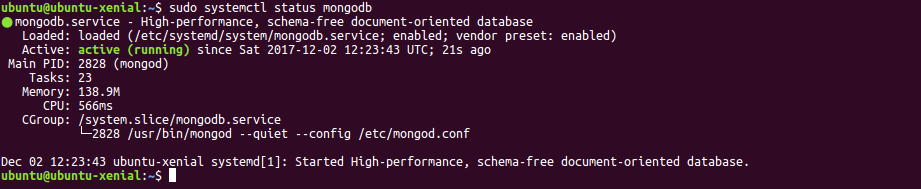

# Instalación de MongoDB y configuración como servicio


- Instalación
- Configuración como servicio
- Administración del servicio
- Algunos archivos y directorios
- Referencias y más información

## Instalación

MongoDB está incluido en el repositorio de paquetes de Ubuntu, pero el **repositorio oficial de MongoDB** proporciona la **versión más actualizada** y ésta es la opción más **recomendable**.

Para poder acceder al repositorio oficial de MongoDB tenemos que **importar su clave pública**, ya que Ubuntu autentica los paquetes de software verificando que hayan sido firmados con claves GPG.

Una vez importada la clave, ya se puede **agregar el repositorio oficial de MongoDB al servidor** para actualizar la base de datos local con la lista de paquetes de Mongo, de modo que la aplicación _apt_ sepa de dónde descargarlos.

Por último, solo queda instalar los paquetes de MongoDB.

La secuencia de comandos es la siguiente:

```
# Importa la clave pública usada por el sistema de gestión de paquetes
sudo apt-key adv --keyserver hkp://keyserver.ubuntu.com:80 --recv 2930ADAE8CAF5059EE73BB4B58712A2291FA4AD5

# Crea la lista de ficheros para MongoDB.
echo "deb [ arch=amd64,arm64 ] http://repo.mongodb.org/apt/ubuntu xenial/mongodb-org/testing multiverse" | sudo tee /etc/apt/sources.list.d/mongodb-org-3.6.list

# Actualiza la base de datos local de paquetes disponibles para Ubuntu
sudo apt-get update

# Instala los paquetes de MongoDB
sudo apt-get install -y mongodb-org
```

Con ésto ya hemos instalado la versión estable más reciente de MongoDB (3.6 en el momento de actualización de este documento), herramientas administrativas para el servidor MongoDB y algunos paquetes adicionales necesarios.

El fichero [InstallMogoDB3.6.sh](InstallMogoDB3.6.sh) contiene el script de instalación.

## Configuración como servicio

Para lanzar MongoDB como un **servicio** de Ubuntu **durante el arranque del sistema** tenemos que crear un archivo de configuración que describa dicho servicio y que informe a _systemd_ cómo debe manejar el recurso.

El **archivo de configuración** se llamará _mongodb.service_ y se ubicará en el directorio _/etc/systemd/system_. Este archivo se puede crear utilizando _nano_ u otro editor de texto.

```
sudo nano /etc/systemd/system/mongodb.service
```

El contenido del fichero de configuración [mongodb.service](mongodb.service) debe ser el siguiente:

```
[Unit]
Description=High-performance, schema-free document-oriented database
After=network.target

[Service]
User=mongodb
ExecStart=/usr/bin/mongod --quiet --config /etc/mongod.conf

[Install]
WantedBy=multi-user.target

bind_ip=0.0.0.0
```

La sección **Unit** contiene un resumen o descripción legible y las dependencias que deberán existir antes de que el servicio pueda iniciarse. En este caso, MongoDB depende de que la red esté disponible (network.target).

La sección **Service** especifica cómo debe iniciarse el servicio. La directiva _User_ indica que deberá correr bajo el usuario _mongodb_, y _ExecStart_ el comando para arrancar el servidor MongoDB.

La sección **Install** le dice a _systemd_ cuándo debe iniciar automáticamente el servicio: _multi-user.target_ es un sistema de secuencias de arranque estándar que hace que el servicio corra automáticamente al arrancar.

Una vez creada el fichero de configuración, lo siguiente es iniciar con _systemctl_ el servicio recién creado:

```
sudo systemctl start mongodb
```

Y, como este comando no responde con ningún mensaje, se puede utilizar este otro para revisar que el servicio ha arrancado apropiadamente:

```
sudo systemctl status mongodb
```
El servidor MongoDB ya está configurado y corriendo como un servicio.



## Administración del servicio

El servidor MongoDB puede administrare utilizando el comando _systemctl_, por ejemplo:
```
# Detener el servicio
sudo systemctl stop mongodb

# Arrancar el servicio
sudo systemctl start mongodb

# Reiniciar el servicio
sudo systemctl restart mongodb

# Comprobar el estado sel servicio
sudo systemctl status mongodb
```

También se puede administrar el servicio con el comando _service_:

```
# Detener el servicio
sudo service mongod stop

# Arrancar el servicio
sudo service mongod start

# Reiniciar el servicio
sudo service mongod restart

# Comprobar el estado sel servicio
sudo service mongod status
```

## Algunos archivos y directorios

Archivo de configuración de MongoDB:
- /etc/mongod.conf

Directorio de datos (definido en el fichero de configuración):
- /var/lib/mongodb

Archivo de logs (definido en el fichero de configuración):
- /var/log/mongodb/mongod.log

Archivo de configuración del servicio de MongoDB _mongod_:
- /etc/systemd/system/mongodb.service

Enlace al ejecutable mongod:
- /usr/bin/mongod

## Referencias y más información
- [Install MongoDB Community Edition on Ubuntu](https://docs.mongodb.com/v3.6/tutorial/install-mongodb-on-ubuntu/)
- [¿Cómo instalar MongoDB en Ubuntu 16.04? ](https://www.digitalocean.com/community/tutorials/como-instalar-mongodb-en-ubuntu-16-04-es)
- [MongoDB (wikipedia)](https://es.wikipedia.org/wiki/MongoDB)
- [Crear una base de datos MongoDB en mLab](https://github.com/garcilanga/mLab-MongoDB-cloud/blob/master/README.md)
